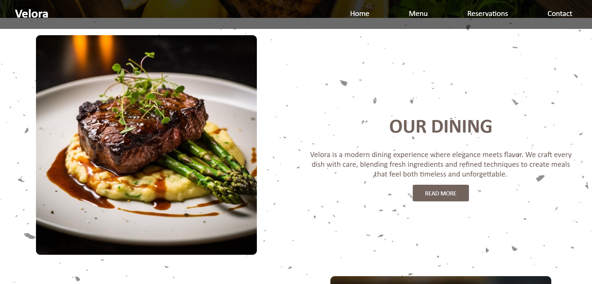
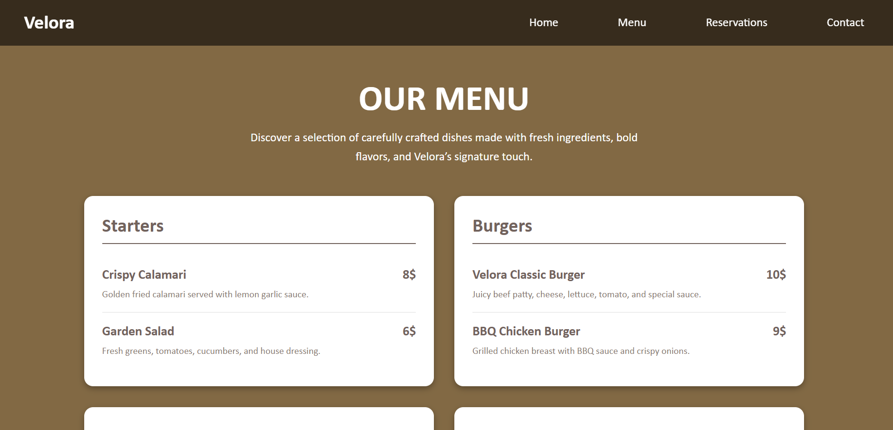
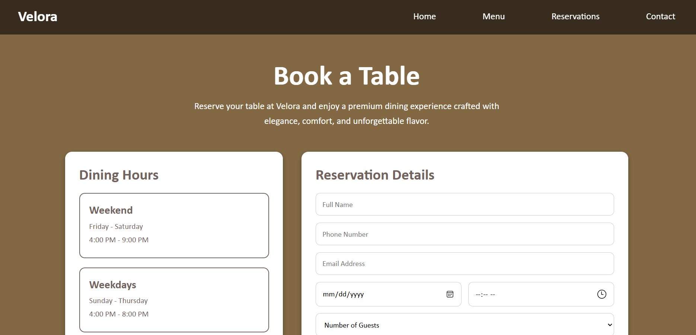
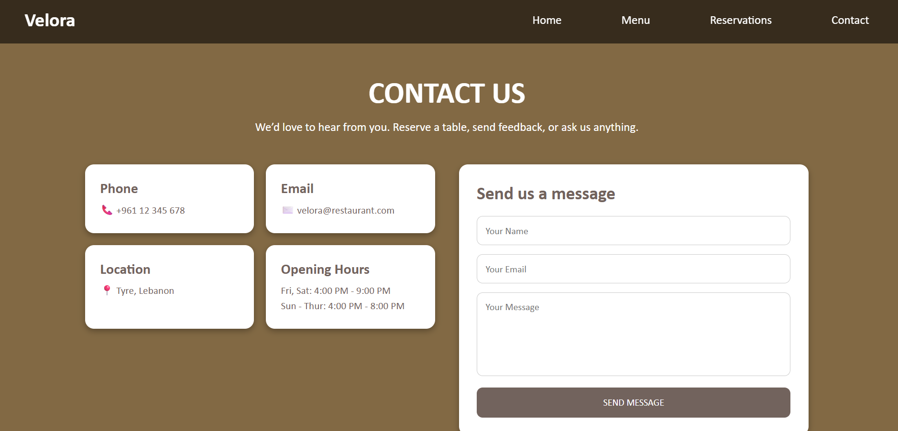
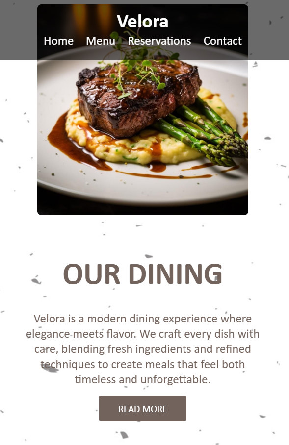

# Velora Restaurant Website

Velora is a responsive restaurant website built using ReactJS. The website allows users to learn about the restaurant, view the menu, reserve a table, and contact the restaurant through a clean and user-friendly interface.

## Project Description

This project is a frontend web application developed as a continuation of the phase-1 restaurant website project. The main goal of the project is to apply ReactJS concepts, responsive web design, UI/UX design principles, and Git/GitHub version control.

Velora solves a real-world restaurant presentation problem by giving customers an easy way to browse restaurant information, explore menu items, check dining details, reserve a table, and contact the restaurant.

## Features

* Responsive Home page
* Menu page with categorized food items
* Reservation page with booking form
* Contact page with contact information and message form
* Reusable Navbar component
* Reusable Footer component
* Navigation using React Router
* Responsive design for desktop and mobile devices
* Version control using Git and GitHub

## Pages

### Home Page

The Home page introduces Velora restaurant, displays restaurant information, highlights the menu, includes a reservation section, and shows today's specials.

### Menu Page

The Menu page displays food items in organized categories with names, descriptions, and prices.

### Reservation Page

The Reservation page includes a booking form where users can enter their name, contact information, date, time, number of guests, and special requests.

### Contact Page

The Contact page includes the restaurant phone number, email, location, opening hours, and a contact form.

## Technologies Used

* ReactJS
* React Router
* JavaScript
* CSS
* HTML
* Git
* GitHub

## Setup Instructions

To run this project locally, follow these steps:

### 1. Clone the Repository

```bash
git clone https://github.com/SalahhShourr/velora-restaurant
```

### 2. Open the Project Folder

```bash
cd velora-restaurant
```

### 3. Install Dependencies

```bash
npm install
```

### 4. Start the Development Server

```bash
npm start
```

### 5. Open the Website

Open this link in your browser:

```txt
http://localhost:3000
```

## Screenshots of the UI

### Home Page



### Menu Page



### Reservation Page



### Contact Page



### Mobile View



## Project Structure

```txt
src/
  App.js
  Home.js
  Menu.js
  Reservation.js
  Contact.js
  Navbar.js
  Footer.js
  style.css
```

## Author

Salah Shour
